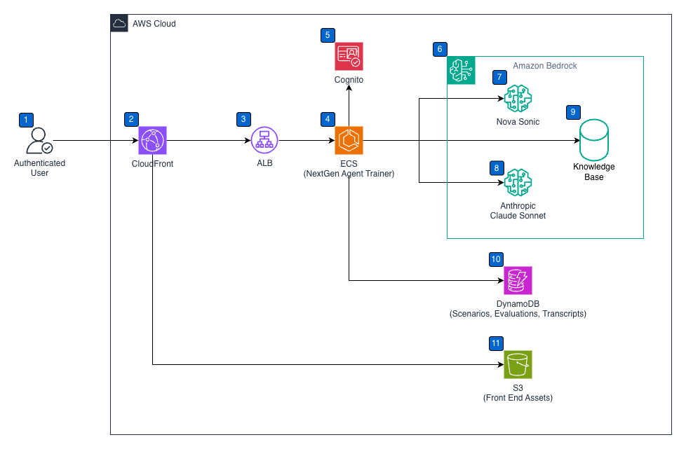

# NextGen Agent Trainer

## Overview
NextGen Agent Trainer (NAT) is an AI-powered training application that enables contact center agents and customer service representatives to practice real-time, speech-to-speech conversations in different scenarios using Amazon Nova Sonic.

### Problem Statement
Challenges with traditional customer service training include
- Traditional role-playing lacks consistency and scalability
- Limited scenario variety in conventional training methods
- No real-time feedback and performance analytics
- High cost of human trainers and scheduling conflicts
- Difficulty simulating diverse customer personalities

### Solution Benefits
This application addresses these challenges by providing:

- Flexible practice and training in the agent's own time and place
- Practice anytime, anywhere flexibility
- Real-time speech-to-speech interactions with natural conversation flow
- Immediate, actionable feedback to improve performance
- Scale training across multiple locations
- Scalable and easy-to-use web-based interface
- Reduce training costs significantly
- Customize personas and scenarios for specific industries and business context
- Experience diverse customer scenarios to build confidence and skills

### Key Limitations
- This is a sample project and not intended to be used in production environments without modification.
- Amazon Nova Sonic service quotas
  - Maximum number of concurrent model inference requests per region: 20
  - Connection limit of 8 minutes, with connection renewal and session continuation pattern available in code samples ([session continuation](https://github.com/aws-samples/amazon-nova-samples/tree/main/speech-to-speech/amazon-nova-2-sonic/repeatable-patterns/session-continuation/console-python), [resume conversation](https://github.com/aws-samples/amazon-nova-samples/tree/main/speech-to-speech/amazon-nova-2-sonic/repeatable-patterns/resume-conversation))
- The following functionality is not included in the sample:
  - Update scenario and delete scenario
  - Modify evaluation criteria
- The application is only supported on Google Chrome.

## Quick Start

### Prerequisites
- AWS CLI configured with appropriate permissions
- Docker installed and running
- Node.js 18+

### Deploy to AWS

Deployments use two scripts with distinct responsibilities:

| Script | Purpose |
|--------|---------|
| `scripts/preparedata.sh` | Upload scenario and KB files to S3, trigger KB re-ingestion |
| `scripts/deploy.sh` | Build & deploy application code and infrastructure |

---

#### First-time setup

```bash
# 1. Upload data to S3 (creates the data bucket, validates scenarios, triggers KB ingestion)
./scripts/preparedata.sh

# 2. Deploy infrastructure and application
./scripts/deploy.sh \
  amazon.nova-2-sonic-v1:0 \
  global.anthropic.claude-sonnet-4-5-20250929-v1:0
```

`preparedata.sh` must run first so the S3 data bucket and scenario/KB files exist before the KB CloudFormation stack is created. On first creation, the KB stack automatically ingests whatever is already in S3.

---

#### Scenario or KB content update only

No code change — just re-upload data and re-ingest:

```bash
./scripts/preparedata.sh
```

---

#### Code change only

No data change — just build and redeploy:

```bash
./scripts/deploy.sh
```

`deploy.sh` parameters (all optional — defaults shown):
```
1. Nova Model ID        amazon.nova-2-sonic-v1:0
2. Reasoning Model ID   global.anthropic.claude-sonnet-4-5-20250929-v1:0
3. Data Bucket Name     nextgen-agent-trainer-data-{accountId}
```

Optional env overrides:
```bash
SUGGESTIONS_MODEL_ID=us.anthropic.claude-haiku-4-5-20251001-v1:0 \
KB_SCORE_THRESHOLD=0.35 \
./scripts/deploy.sh
```

`deploy.sh` runs end-to-end:
1. Build & push Docker image to ECR
2. Deploy main CloudFormation stack (VPC, ECS, ALB, Cognito, DynamoDB, S3)
3. Deploy Knowledge Base stack (AOSS collection + Bedrock KB) — first time only
4. Generate `frontend/public/config.js` from CFN outputs
5. Build React frontend and sync to S3, invalidate CloudFront
6. Force-cycle ECS tasks to pick up new image

---

### Cleanup

```bash
./scripts/cleanup.sh
```

Empties and deletes all managed S3 buckets (transcripts, frontend), deletes both CloudFormation stacks, and deletes the ECR repository. The data bucket (`nextgen-agent-trainer-data-{accountId}`) is preserved.

**To test a completely fresh deploy:**
```bash
./scripts/cleanup.sh
./scripts/preparedata.sh
./scripts/deploy.sh
```

## Repository Structure

```
├── data/                        # Scenario and Knowledge Base source data
│   ├── schema.json              # JSON schema for scenario validation
│   ├── scenarios/               # One JSON file per business vertical (e.g. telco.json, airline.json)
│   │                            # Add or update files here to extend training coverage
│   └── kb/                      # Knowledge Base markdown files organised by vertical
│                                # (uploaded to S3 kb/ and ingested into Bedrock KB)
├── backend/                     # Node.js/Express API + WebSocket server
│   ├── src/                     # TypeScript source
│   │   ├── server.ts            # Main server entry point
│   │   ├── dynamodb-service.ts
│   │   ├── scenario-service.ts
│   │   ├── scenarios-routes.ts
│   │   └── ...
│   └── Dockerfile               # Container config (deployed to ECS Fargate)
├── frontend/                    # React + Vite SPA
│   ├── src/
│   │   ├── App.tsx              # Root component, auth, tab routing
│   │   ├── pages/               # LiveTrainingPage, ScenarioBuilderPage, etc.
│   │   ├── hooks/               # useAuth, useSocket
│   │   └── api/                 # API client, scenarios
│   ├── public/
│   │   └── config.js            # Runtime config (auto-generated by deploy.sh)
│   └── dist/                    # Production build → S3/CloudFront
├── shared/                      # Shared TypeScript types
│   └── types.ts
├── infrastructure/
│   └── cloudformation/
│       ├── nextgen-agent-trainer.yaml     # Main stack (VPC, ECS, Cognito, DynamoDB, S3)
│       └── nextgen-agent-trainer-kb.yaml  # KB stack (AOSS, Bedrock Knowledge Base)
├── scripts/
│   ├── preparedata.sh           # Upload scenarios + KB to S3, trigger KB re-ingestion
│   ├── deploy.sh                # Build and deploy application code and infrastructure
│   ├── validate-scenarios.sh    # Validate scenario JSON against schema (called by preparedata.sh)
│   └── cleanup.sh               # Tear down everything (stacks, ECR, S3 buckets)
└── docs/
```

## Solution Architecture



```
┌─────────────────────────────────────────────────────────────┐
│ Data Layer                                                  │
│ data/scenarios/*.json → S3 → Lambda → DynamoDB              │
│ data/kb/*.md → S3 (kb/) → Bedrock Knowledge Base (AOSS)     │
└─────────────────────────────────────────────────────────────┘
                          ↓
┌─────────────────────────────────────────────────────────────┐
│ Frontend Layer                                              │
│ React SPA (Vite) → S3 → CloudFront (/*)                     │
└─────────────────────────────────────────────────────────────┘
                          ↓
┌─────────────────────────────────────────────────────────────┐
│ Backend Layer                                               │
│ CloudFront (/api/*, /socket.io/*) → ALB → ECS Fargate       │
│   REST API (/api/scenarios, /api/evaluate, /api/transcript) │
│   Socket.IO → Bedrock Nova Sonic (speech-to-speech)         │
│   Claude → agent suggestions + conversation evaluation      │
└─────────────────────────────────────────────────────────────┘
                          ↓
┌─────────────────────────────────────────────────────────────┐
│ AWS Services                                                │
│ Cognito · DynamoDB (scenarios/evals) · S3 (transcripts)     │
│ Bedrock Knowledge Base (AOSS) · CloudWatch                  │
└─────────────────────────────────────────────────────────────┘
```

**Frontend (React + Vite → S3 + CloudFront):**
- Real-time audio streaming via Socket.IO
- Live Training: scenario selection, custom scenario mode, competition mode
- AI-powered agent suggestions panel (backed by Bedrock Knowledge Base)
- Scenario Builder: create and save custom training scenarios
- Evaluation History
- Cognito-based authentication

**Backend (Node.js/Express → ECS Fargate):**
- TypeScript with Express and Socket.IO
- REST API for scenario management (`/api/scenarios`)
- WebSocket/Socket.IO for Bedrock Nova Sonic audio streaming
- DynamoDB integration for scenarios and evaluations
- Evaluation and AI suggestions with Knowledge Base retrieval

**CloudFormation Stacks:**
- `nextgen-agent-trainer-dev` — main stack: VPC, ECS Fargate, ALB, CloudFront, Cognito, DynamoDB, S3
- `nextgen-agent-trainer-dev-kb` — KB stack: OpenSearch Serverless (AOSS) collection + Bedrock Knowledge Base + data source sync

## Configuration

All configuration is managed via CloudFormation parameters and deploy.sh defaults:

| Parameter | Description | Default |
|----------|-------------|--------|
| `NovaModelId` | Bedrock Nova Sonic model for speech-to-speech | `amazon.nova-2-sonic-v1:0` |
| `ReasoningModelId` | Claude model for evaluation and reasoning | `global.anthropic.claude-sonnet-4-5-20250929-v1:0` |
| `SuggestionsModelId` | Claude model for real-time agent suggestions | `us.anthropic.claude-haiku-4-5-20251001-v1:0` |
| `KbScoreThreshold` | Min Bedrock KB retrieval score to show a suggestion (0–1) | `0.5` |
| `DataBucketName` | S3 bucket with scenarios and KB files | `nextgen-agent-trainer-data-{accountId}` |
| `KnowledgeBaseId` | Bedrock KB ID — set automatically after KB stack deploys | _(auto)_ |

`SuggestionsModelId` and `KbScoreThreshold` can be overridden at deploy time via env vars:
```bash
SUGGESTIONS_MODEL_ID=us.anthropic.claude-haiku-4-5-20251001-v1:0 \
KB_SCORE_THRESHOLD=0.4 \
./scripts/deploy.sh ...
```

### Environment Variables (auto-configured by deploy.sh)
- `TRANSCRIPT_BUCKET_NAME` — S3 bucket for session transcripts
- `SCENARIOS_TABLE_NAME` — DynamoDB table for scenarios
- `EVALUATIONS_TABLE_NAME` — DynamoDB table for evaluations
- `COGNITO_*` — authentication configuration
- `KNOWLEDGE_BASE_ID` — Bedrock KB ID for agent suggestions
- `NOVA_MODEL_ID`, `REASONING_MODEL_ID`, `SUGGESTIONS_MODEL_ID`, `KB_SCORE_THRESHOLD`

## Scenario Management

### Data Structure

Scenarios live in `data/scenarios/` as JSON files:

```json
{
  "businessName": "telco",
  "scenarios": [
    {
      "scenarioId": "james-anderson",
      "personaName": "James Anderson",
      "scenarioName": "High Bill Complaint",
      "voiceId": "matthew",
      "demographics": { "age": 45, "gender": "Male", "location": "Melbourne, Australia", "accountPin": "7258" },
      "behavior": { "communicationStyle": "...", "emotionalState": "..." },
      "customerObjectives": { "primary": ["..."], "secondary": ["..."] },
      "agentObjectives": { "primary": ["..."], "secondary": ["..."] },
      "prompt": "Full system prompt..."
    }
  ]
}
```

### Adding/Updating Scenarios

1. Edit or add a file in `data/scenarios/`
2. Validate: `./scripts/validate-scenarios.sh`
3. Upload and reload: `./scripts/preparedata.sh`

### Knowledge Base Content

Markdown files in `data/kb/` are synced to `s3://{data-bucket}/kb/` and ingested into the Bedrock Knowledge Base. Add or edit `.md` files there to update what the agent suggestions panel can retrieve, then run:

```bash
./scripts/preparedata.sh
```

### Adding a New Business Vertical

1. Create `data/scenarios/{vertical}.json` with `"businessName": "{vertical}"`
2. Optionally add KB articles to `data/kb/{vertical}/`
3. Run `./scripts/preparedata.sh`
4. Select the new vertical from the dropdown in the UI

## Local Development

```bash
# Backend (needs a deployed AWS stack for Bedrock/DynamoDB/Cognito)
cd backend && npm install && npm run dev
# Runs at: http://localhost:3000

# Frontend
cd frontend && npm install && npm run dev
# Runs at: http://localhost:5173
# Edit frontend/public/config.js to point cognitoUserPoolId/clientId at your deployed stack
```

## API Endpoints

- `GET /api/scenarios/businesses` — list available business verticals
- `GET /api/scenarios?business=telco` — list scenarios for a business
- `GET /api/scenarios/:scenarioId?business=telco` — get a specific scenario
- `GET /health` — ECS health check

## DynamoDB Table Design

**Scenarios table** (`nextgen-agent-trainer-dev-scenarios`):
```
PK: BUSINESS#{businessName}   SK: SCENARIO#{scenarioId}
```

**Evaluations table** (`nextgen-agent-trainer-dev-evaluations`):
```
PK: {sessionId}
GSI: user_name-timestamp-index  (for history/leaderboard queries)
GSI: transcript_hash-index      (deduplication)
```

## Security

- ECS tasks run in private subnets, no public IP
- ALB with security groups restricts inbound to HTTP/HTTPS only
- IAM least-privilege roles for ECS task, Lambda, and Bedrock KB
- Cognito User Pool with email verification
- All S3 buckets have public access blocked
- CloudFront OAC for S3 frontend (no direct bucket access)

## Monitoring & Logging

- CloudWatch Logs: `/ecs/nextgen-agent-trainer-dev` for all container logs
- ALB health checks via `GET /health`
- Lambda logs: `/aws/lambda/nextgen-agent-trainer-dev-scenario-loader` and `-kb-sync`

## Troubleshooting

### Scenarios Not Loading
```bash
# Check Lambda logs
aws logs tail /aws/lambda/nextgen-agent-trainer-dev-scenario-loader --follow

# Verify data in DynamoDB
aws dynamodb scan --table-name nextgen-agent-trainer-dev-scenarios --limit 5

# Verify S3 data
aws s3 ls s3://nextgen-agent-trainer-data-{accountId}/scenarios/
```

### Knowledge Base Issues
```bash
# Check KB sync Lambda logs
aws logs tail /aws/lambda/nextgen-agent-trainer-dev-kb-sync --follow

# Verify KB files in S3
aws s3 ls s3://nextgen-agent-trainer-data-{accountId}/kb/
```

### ECS Task Unhealthy
```bash
# Check container logs
aws logs tail /ecs/nextgen-agent-trainer-dev --follow

# Check ECS service events
aws ecs describe-services \
  --cluster nextgen-agent-trainer-dev \
  --services nextgen-agent-trainer-dev \
  --query 'services[0].events[:5]'
```

### Validation Fails
```bash
npm install -g ajv-cli ajv-formats
ajv validate -s data/schema.json -d data/scenarios/telecommunications.json
```

## CI/CD Integration

```yaml
# Code change pipeline
- name: Deploy application
  run: ./scripts/deploy.sh
  env:
    AWS_ACCESS_KEY_ID: ${{ secrets.AWS_ACCESS_KEY_ID }}
    AWS_SECRET_ACCESS_KEY: ${{ secrets.AWS_SECRET_ACCESS_KEY }}
    AWS_REGION: us-east-1

# Data change pipeline (run when data/scenarios/ or data/kb/ changes)
- name: Upload data and re-ingest KB
  run: ./scripts/preparedata.sh
  env:
    AWS_ACCESS_KEY_ID: ${{ secrets.AWS_ACCESS_KEY_ID }}
    AWS_SECRET_ACCESS_KEY: ${{ secrets.AWS_SECRET_ACCESS_KEY }}
    AWS_REGION: us-east-1
```

## Security

See [CONTRIBUTING](CONTRIBUTING.md#security-issue-notifications) for more information.

## License

This library is licensed under the MIT-0 License. See the LICENSE file.

